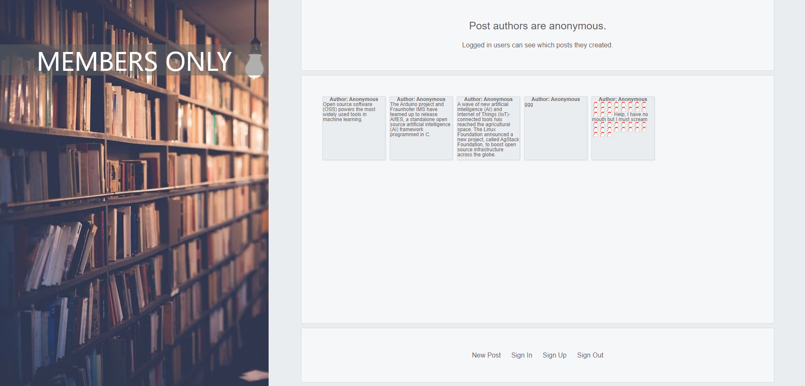

# Members Only

[Members Only](https://peaceful-river-81983.herokuapp.com/) is a full-stack Rails app built from scratch, providing Users with the ability to create anonymous posts. While not signed out all posts are Anonymous, but upon signing up and signing in a user can create new posts, and see the posts they have created in the past.

## Demo

## How to Access

[This link will take you to the live website](https://peaceful-river-81983.herokuapp.com/) deployed on heroku. View all posts anonymously without signing in, or sign-in with the username: `user1` and the password: `password1` to create new posts. 

## Features

- Authenticate user data using Devise to ensure client privacy
- Perform integration testing with Capybara to ensure function properly together and align with project requirements
- Use MVC design pattern to separate Models and Views from Controllers for ease of code maintainability
- Utilize flash to show form validation errors for smoother UX experience
- Fix Rubocop warnings to decrease probability of future bugs and errors in the code
- Use Flexbox and Grid together for layout and design of each View
